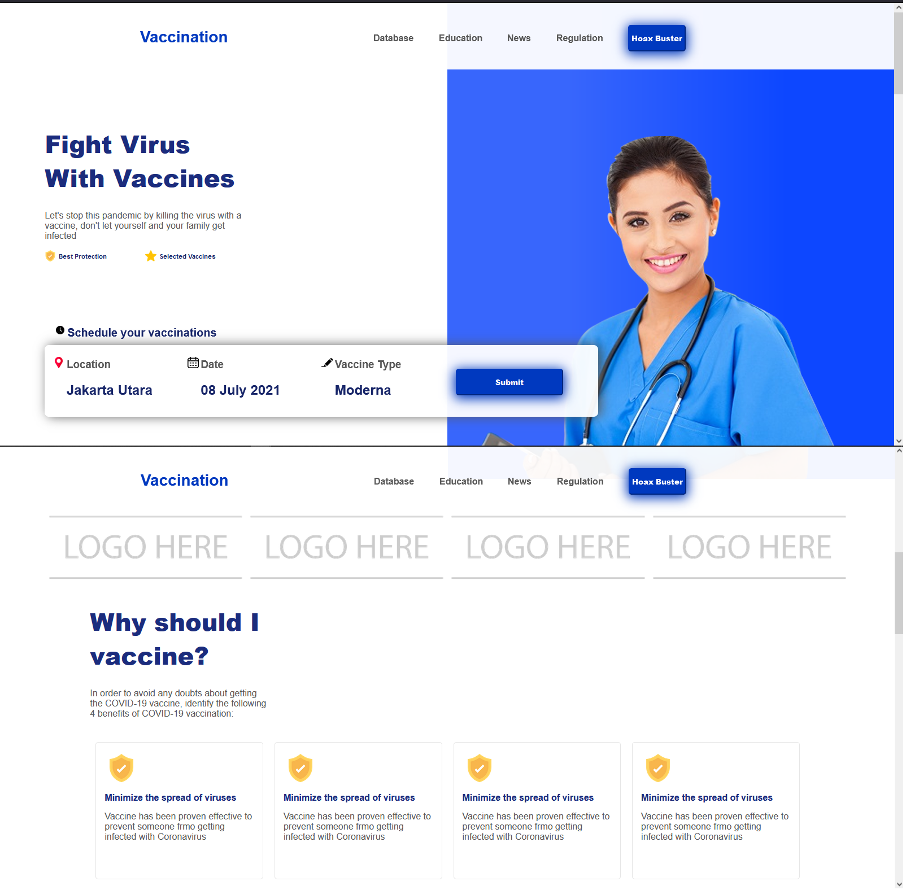
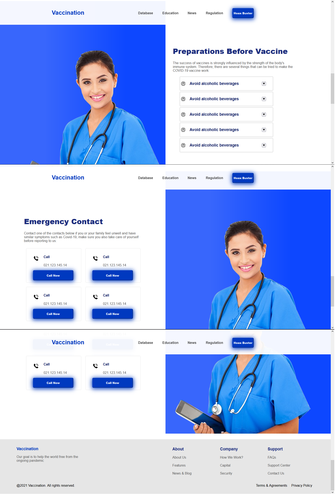

# Vaccine Website Recreation

This week's practice was to try and recreate a website's design
as closely as possible.

This was my attempt, with the time that I had.
There are quite a bit of mistakes, and I did it in a hurry, so I did not plan for things like reusing classes,
so some things are repeated throughout, like the colors for text and buttons.

Also, I don't know If I have permission to upload the nurse image, or the logo-placeholder image.
I have an Image from Unsplash, which I think is fine, and I have icons from Flaticon,
which are lacking a visible reference in the website, but I hope I didn't miss adding them at least in a commented line.

Therefore, I decided to leave both the nurse image and the logo-placeholder image out of the repo; please do replace them with similar images,
svg, png, or any other format, so long as it doesn't have a background.

## Screenshots

  

Here's the other half:
